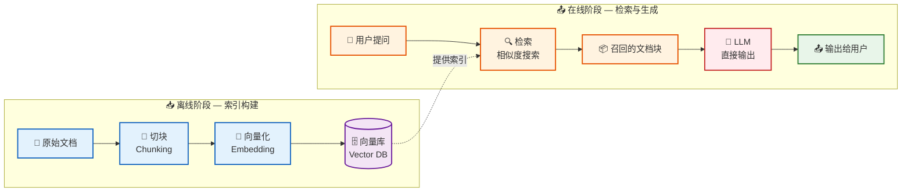
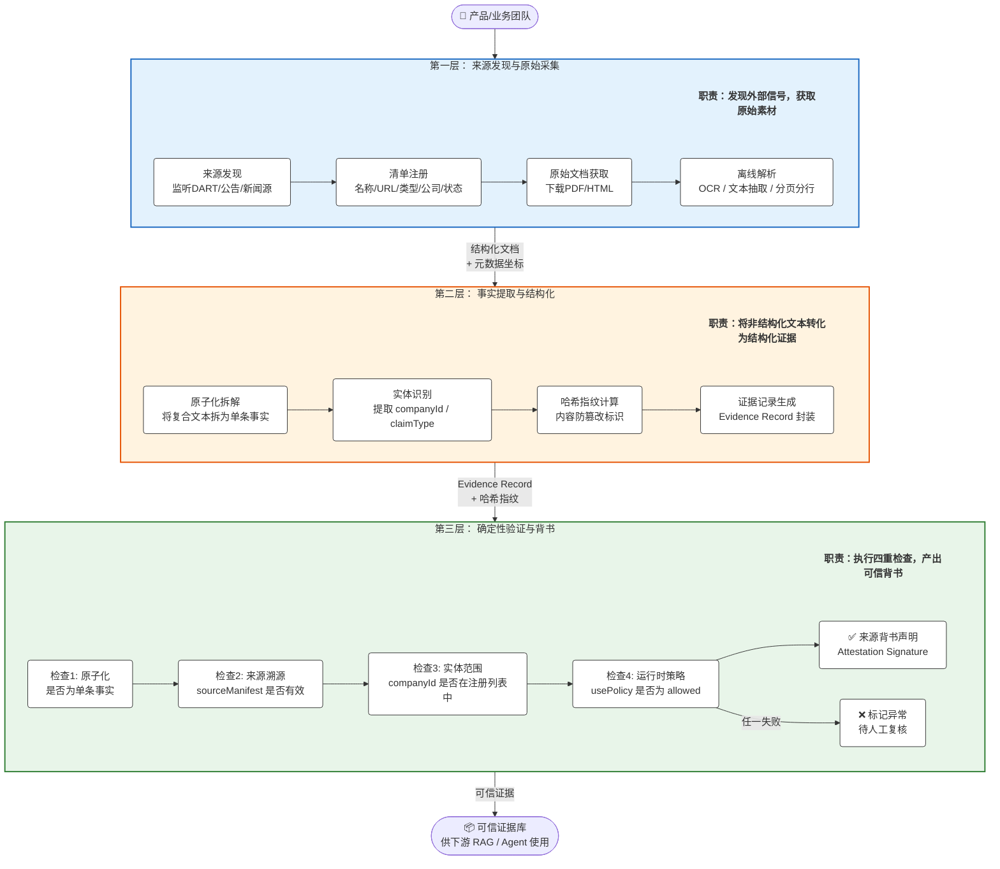
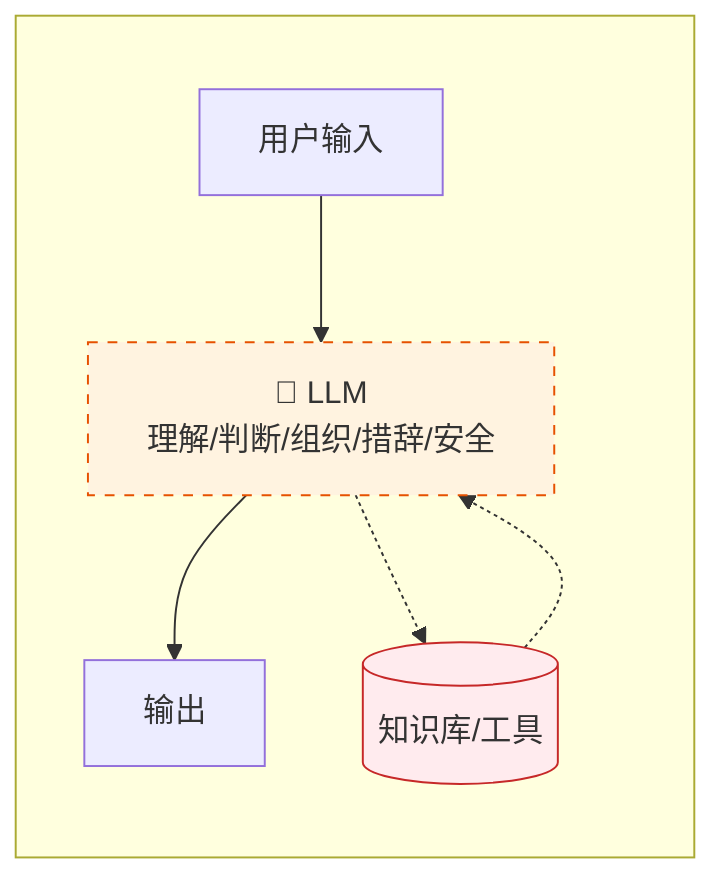
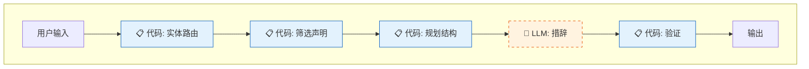
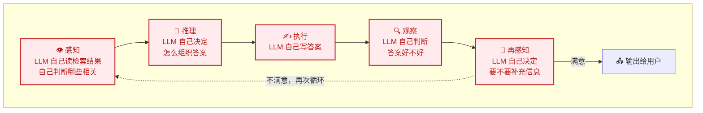
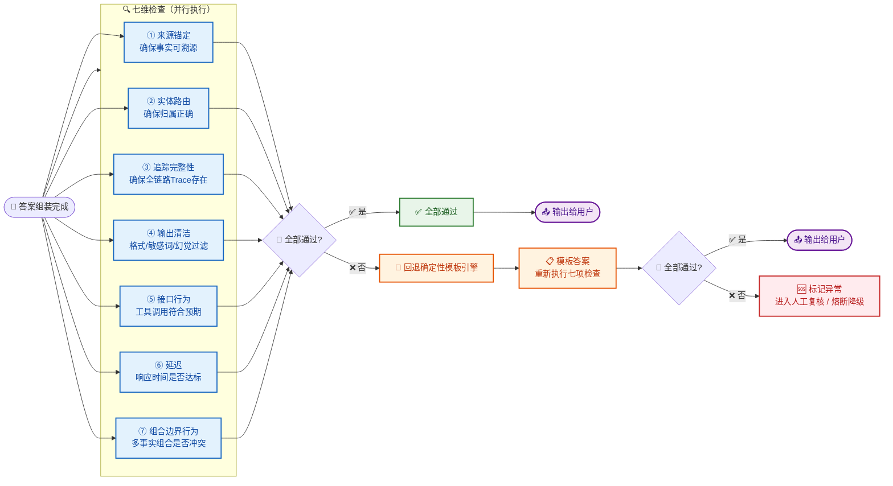

# 什么是Harness

Harness不是一门技术，也不是一个框架，而是一种智能体的开发架构方案。
$$
Agent = LLM + Harness
$$
Harness 设计的核心：把 LLM 压缩到最小范围，用代码包围它。

AI 发展的三个阶段：

| 阶段                    | 解决的问题                                       | 典型工作                                 |
| ----------------------- | ------------------------------------------------ | ---------------------------------------- |
| **Prompt Engineering**  | 怎么把指令说清楚，模型理解减少歧义               | 系统提示词设计、Few-shot示例、思维链引导 |
| **Context Engineering** | 在合适时机给模型提供正确且必要的信息             | 上下文管理、RAG、记忆注入、Token优化     |
| **Harness Engineering** | 构建一个稳定可靠的系统（执行、纠偏、观测和恢复） | 文件系统、沙箱、约束执行、反馈回路、观测 |

# From Prompts to Contracts Harness Engineering 总结

通过**来源锚定、实体路由、追踪、输出清洁、推荐语言合约**构成了**Agent非功能性需求**的完整闭环。

## 四项贡献

#### 贡献一

Harness  Engineer用于将提示主导的企业级LLM重构为**可追踪的**智能体架构。

- 来源到声明的离线管线（清单→证据→候选→提升门→声明）
- 运行时答案组装流程（路由→收集→规划→组合→验证）
- 代码拥有的控制层（产品规则+验证门）
- 可替换的组合边界（模板引擎/LLM）
- 每个答案可审计的追踪机制

#### 贡献二

传统RAG

从来源到声明的knowledge pipeline，将原始文档、证据记录、背书声明、wiki上下文和面向用户的回答分离开来。

#### 贡献三

传统架构

一个可替换的组合边界，将确定性Harness控制与LLM措辞分离。

#### 贡献四

传统智能体中LLM 是大脑，包揽所有决策，LLM感知出错导致后面所有的节点都错误。

一套系统级验证设计：**答案输出给用户之前，必须同时通过这七道检查，任何一道不通过就不能输出**。检查来源锚定、实体路由、追踪完整性、输出清洁、运行时接口行为、延迟和实时LLM组合边界行为。

## 3个问题

RQ1 ：规则确定以后，系统实际运行时能不能每次都守住这些规则。

RQ2 ：验证换了 LLM 之后还能不能保持。

RQ3 ：要证明"代码控制层"是真正起作用的结构，不是可以靠提示词替代的。

# 基于Harness可追踪架构

知识管线层（离线构建）：把原始数据变成可验证的声明库。

| 组件            | 技术选型              | 做什么                                                       |
| :-------------- | :-------------------- | :----------------------------------------------------------- |
| Source config   | YAML + PostgreSQL     | 注册可用来源（API端点、文件路径、更新周期、使用策略），YAML做版本控制，DB做运行时查询 |
| Fetcher         | Python爬虫            | 按清单从外部获取原始文档（财报、API数据、新闻），存为结构化证据记录 |
| Claim extractor | LLM + 人工审核        | 用LLM从证据中提取可验证声明（如"三星2024年合并营收300.9万亿韩元"），人工审核确认 |
| Promotion gate  | 规则引擎              | 验证声明是否有来源锚定、页码定位、实体归属，通过后才"提升"为背书声明 |
| Claims store    | PostgreSQL + pgvector | 结构化存储声明（实体、来源、页码、声明文本），pgvector存语义向量供运行时检索 |

运行时引擎层：所有控制逻辑由代码而非提示词拥有。

| 组件                | 技术选型                      | 做什么                                                       |
| :------------------ | :---------------------------- | :----------------------------------------------------------- |
| API gateway         | FastAPI                       | 接收用户提问，返回结构化答案                                 |
| Entity router       | 代码规则 + 正则 + 轻量NER模型 | 确定问题指向哪个实体（公司/集团），不交给LLM判断             |
| Claim selector      | SQL + 向量搜索                | 从声明库中选取与问题相关的声明，SQL过滤实体范围，向量搜索匹配语义 |
| Contract builder    | Pydantic schema               | 定义答案结构（关键洞察、财务要点、风险、关注点），约束输出格式 |
| Compostion boundray | 组合边界                      | 实时组装：把声明和合约传给LLM生成自然语言答案，支持多模型切换； 确定性组装：把选中的声明填入模板，不调用LLM，作为回退路径； |
| Validation gate     | 规则引擎                      | 7项检查：来源锚定、实体路由、追踪完整、输出清洁、接口行为、延迟、组合边界 |
| Response builder    | 代码组装                      | 组装最终答案 + 生成审计追踪记录                              |

基础设施层

| 组件           | 技术选型                   | 做什么                                                       |
| :------------- | :------------------------- | :----------------------------------------------------------- |
| Trace store    | PostgreSQL                 | 存储每次请求的完整审计追踪（选了哪些声明、走了哪条组合路径、验证结果） |
| Audit log      | Elasticsearch / PostgreSQL | 面向审计员的日志检索，支持按时间、实体、来源查询             |
| Eval framework | pytest                     | 固定验证场景（问题+期望声明+期望信号），CI中自动运行         |
| CI/CD          | Git + Jenkins              | 每次代码变更自动跑验证场景，合约不通过则阻止部署             |
| Monitoring     | Grafana + Prometheus       | 监控延迟、回退率、验证失败率、合约通过率                     |
| External LLMs  | OpenAI / Anthropic         | 通过LLM adapter统一调用，可随时切换模型                      |
